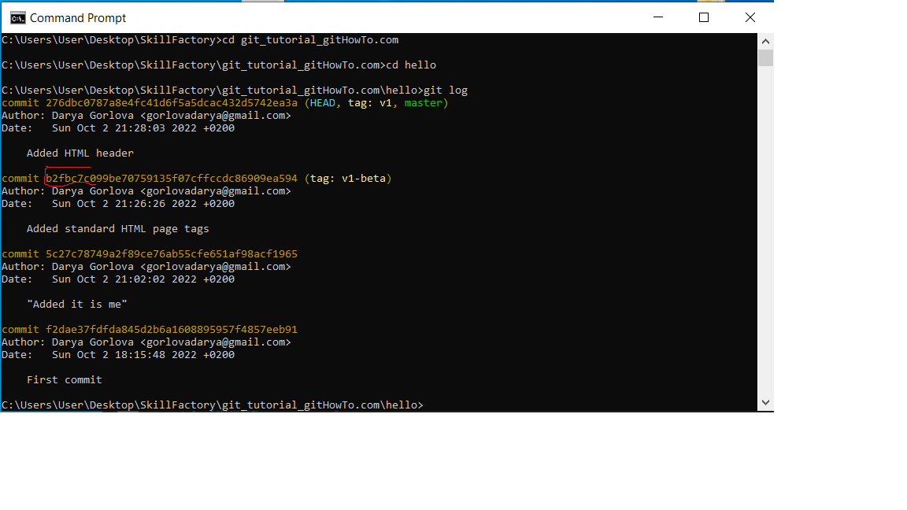
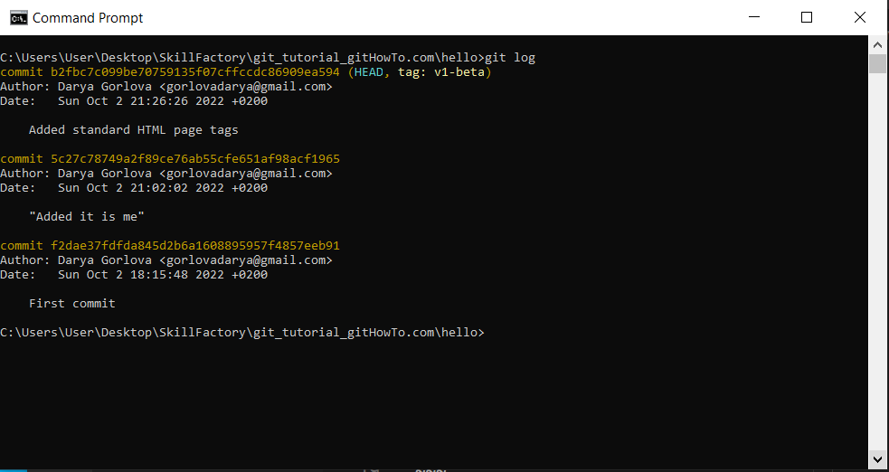

# Where are my commit hashes?

1. Check you log history

~~~cmd=
git log
~~~

**Note:** *to move to the hash you want is enough to use the first seven symbols*    
  

2. Move to the previous commit
~~~cmd=
git checkout b2fbc7c
~~~

3. Check your result
~~~cmd=
git log
~~~

**Note:** *you see that now there is only three commits (instead of four) and HEAD pointer shows at commit hash b2fbc7c*

4. To return back to the forth commit checkout current branch

~~~cmd=
git checkout master
~~~
**Note:** *checkout branch_name always traverse to the latest node of the commit tree*
